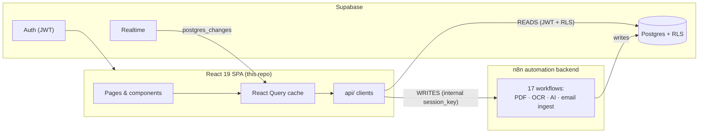
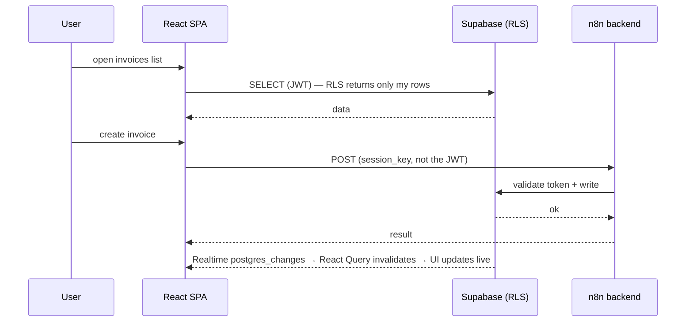

<!--
================================================================
README del repo github.com/superTay/react-web-architecture-showcase
================================================================

Para usarlo:
1. Sube el archivo logo-web.png al repo en la ruta `assets/logo-web.png`.
2. En GitHub, edita el README del repo, borra todo el contenido actual
   y pega lo de abajo (desde la línea <div align="center"> hasta el final).
3. Commit a main.

Cambios respecto a la versión anterior:
- Logo: assets/logo.svg → assets/logo-web.png (160px, clicable hacia la app)
- Botón CTA "Open live app" justo debajo del título
- Link al portfolio interactivo al final (cierra el loop)
- Todo lo demás (arquitectura, mermaid, fiscal math, trade-offs) intacto
================================================================
-->

<div align="center">

<a href="https://app.konquerai.com">
  
</a>

# KonquerAI — Web Dashboard

**The React + TypeScript front end of a production invoicing & quoting SaaS for self-employed tradespeople in Spain.**

Quotes, issued & received invoices, clients, profitability and Spanish tax math (VAT / IRPF) — in one zero-friction dashboard.

<p>
  <a href="https://app.konquerai.com"></a>
  <a href="https://christian-marzal-portfolio.vercel.app/"></a>
</p>


</div>

> ⚠️ **This is a curated, sanitized public extract** of a private production app
> ([app.konquerai.com](https://app.konquerai.com), private beta with real users).
> It contains the engineering pieces that are interesting *and* safe to show.
> Real keys, URLs, the full data model and most business logic stay private.
> The fiscal and normalization modules are **real and fully tested** (`npm test` → 36 green).

---

## TL;DR

KonquerAI is the admin software a Spanish builder/painter/electrician *actually opens*.
A 50-year-old tradesperson with no time and no patience for software can issue a
legally-compliant invoice, send a quote, and see what the taxman is owed this
quarter — without learning accounting. This repo is its **web client**: a React 19
SPA that reads from Supabase (RLS) and pushes every write through an n8n automation
backend.

## The problem

Spanish self-employed tradespeople drown in paperwork: correlative invoice
numbering, VAT (IVA) at 21% / 10%, IRPF withholding, quarterly tax forms (Modelo
303 / 130), supplier invoices arriving by email, delivery notes to reconcile.
Existing tools assume the user is an accountant. KonquerAI assumes the opposite:
**every screen must be obvious, every frequent action a couple of clicks, every
error message written in plain human language.**

## What it does — features → user benefit

| Feature | What the user gets |
|---------|--------------------|
| **Quotes** (presupuestos) created by chat/voice, auto-generated PDF | "I describe the job, the quote writes itself." |
| **Issued invoices** with Spanish compliance: correlative numbering, VAT/IRPF, VeriFactu-ready hashing | "My invoices are correct — the taxman side is handled by the app." |
| **Received invoices** ingested from email + OCR, auto-classified | "I forward the supplier email and the invoice files itself." |
| **Clients & suppliers** with duplicate detection | "It recognizes a client I already have instead of creating a copy." |
| **Reconciliation** (albarán ↔ factura), VAT-aware matching | "Delivery notes match their invoices automatically." |
| **Profitability per job** (rentabilidad por obra) | "I know if I'm making or losing money on each job." |
| **KPI dashboard**: owed to me / owed by me / VAT this quarter / trend | "One screen tells me where the money is." |

Three product pillars drive every decision:

1. **The taxman side is handled** — invoicing + VAT + reminders.
2. **You know if you win or lose on each job** — real per-job profitability.
3. **You talk, you don't type** — AI + voice + camera, zero friction.

---

## Architecture

A thin, fast SPA with **no backend of its own**. It leans on two external backends
and enforces one rule: **reads from Supabase, writes through n8n.**



**The read/write split:**



Two rules the codebase enforces:

1. **Reads** go straight to Supabase, trusting row-level security by `user_id` —
   the client never filters by user itself. **Writes** of business entities go
   *only* through n8n, carrying an internal `session_key` — never the Supabase JWT.
2. That `session_key` is **auto-renewed** (7-day TTL, renewed within a 2-day
   margin) and decoupled from Supabase's auth tokens, so the two rotate
   independently without logging the user out.

---

## Engineering highlights

- 🔐 **Dual-auth session management** — Supabase JWT for RLS reads + a separate
  internal token for the automation backend, with auto-renewal and a fail-safe
  that never overwrites a good user object with a half-built one. Includes a fix
  for a subtle expired-token race on `INITIAL_SESSION`.
- 🧮 **Exact Spanish fiscal math** — VAT/IRPF, cent-level rounding, NIF/NIE/CIF
  validation, and a **fail-closed** rule that *refuses* to total a mixed-VAT
  invoice rather than silently computing it wrong.
- ⚡ **Realtime sync** — Supabase `postgres_changes` invalidate React Query caches
  so a change on the phone shows up on the open laptop tab instantly; polling
  stays only as a slow safety net.
- 🛡️ **RLS-first data access** — the Realtime channel filter mirrors the RLS
  policy, so a user only ever receives events for their own rows.
- 🤖 **AI as input, not as calculator** — chat/voice/OCR flows (handled in the n8n
  backend) parse natural language and images, but every fiscal total is
  recomputed deterministically client-side. AI never decides a tax amount.

## Why these files

| File | Pattern it demonstrates |
|------|-------------------------|
| [`src/utils/fiscal.ts`](src/utils/fiscal.ts) | Exact VAT/IRPF math, rounding, NIF/NIE/CIF validation, **fail-closed** mixed-VAT handling. **Real, tested.** |
| [`src/__tests__/fiscal.test.ts`](src/__tests__/fiscal.test.ts) | 24 unit tests for the fiscal module — rounding edges, VAT/IRPF, ID validation, fail-closed. **Runnable.** |
| [`src/utils/normalization.ts`](src/utils/normalization.ts) | A **JS mirror of SQL functions**, pinned by tests, so the client computes the same canonical client key as the DB → no duplicate records from drift. **Real, tested.** |
| [`src/__tests__/normalization.test.ts`](src/__tests__/normalization.test.ts) | 12 tests pinning that JS↔SQL contract. **Runnable.** |
| [`src/auth/AuthContext.example.tsx`](src/auth/AuthContext.example.tsx) | **Dual-auth** lifecycle: JWT + internal session token, auto-renewal, fail-safe state, expired-token race fix. |
| [`src/realtime/useRealtimeSync.example.ts`](src/realtime/useRealtimeSync.example.ts) | **Realtime → React Query** cache invalidation with an RLS-aligned channel filter. |
| [`src/api/apiClient.example.ts`](src/api/apiClient.example.ts) | The **read/write split + dual-auth transport** with `AbortController` timeouts and human-readable error mapping. |
| [`src/lib/config.example.ts`](src/lib/config.example.ts) · [`supabase.example.ts`](src/lib/supabase.example.ts) | Env-driven config (no hardcoded keys) and a dev proxy to dodge CORS — with a real war story. |

---

## Tech stack

| Layer | Tech |
|-------|------|
| Framework | Vite 6 · React 19 · TypeScript 5.8 |
| Styling | Tailwind CSS v4 |
| Server state | TanStack React Query v5 |
| Routing | React Router v7 |
| Data & auth | Supabase (Auth + Postgres + RLS + Realtime) |
| Backend logic | n8n workflows (webhooks) |
| Charts / UI | Recharts · Motion · Lucide · react-hot-toast |
| Testing | Vitest + Testing Library |
| Deploy | Vercel |

## Engineering decisions (real trade-offs)

1. **No backend of its own — n8n does the writes.** As a solo dev, n8n let me build
   complex flows (PDF, OCR, AI, email) visually without maintaining a server. Cost:
   less testability. Mitigation: the logic that *can't* fail (fiscal math, invoice
   numbering) lives in deterministic TS + Postgres, not in n8n.
2. **Correctness lives in the database.** Invoice numbering must be gap-free under
   concurrency (a gap is a tax infringement), so it's a `FOR UPDATE`-locked Postgres
   function, not an app-side read-modify-write that two requests could race.
3. **Fail-closed over silently-wrong.** Mixed VAT rates in one invoice are rare and
   hard to total correctly, so the app *blocks* them with a clear message instead
   of half-supporting them. A blocked invoice beats a wrong tax total.
4. **One source of truth, mirrored on purpose.** Client-side `normalization.ts`
   re-implements two SQL functions so the UI can warn "this client already exists"
   *before* the write. The mirror is a drift risk, so it's pinned by unit tests.
5. **Realtime is the hot path, polling is the safety net.** The UI feels live via
   `postgres_changes`; a slow `refetchInterval` only covers dropped subscriptions.

## What's sanitized

- Product brand kept (**KonquerAI** — author's choice), but all secrets removed.
- Supabase URL & anon key, n8n webhook domain, AI/email API keys → **env vars**,
  never hardcoded. Templates in `.env.example` and `*.example.*` files.
- Most business logic, the full data model, RLS policies and the 17 n8n workflows
  stay in the private repo. The `*.example.*` files are illustrative extracts
  (read for the pattern, not compiled); the fiscal/normalization core is real.

---

## The KonquerAI ecosystem (all built solo)

| Repo | What it is |
|------|------------|
| **Web dashboard** (this repo) | React/TS front end — the source-of-truth contracts the other clients mirror. |
| [📱 Flutter mobile app](https://github.com/superTay/flutter-mobile-architecture-showcase) | The mobile companion (TestFlight-approved): offline-first cache, dual-auth, fiscal math ported 1:1 for cross-language parity. |
| [⚙️ Automation backend](https://github.com/superTay/konquerai-automation-backend) | 17 n8n workflows: OCR, conversational AI assistants, email-to-invoice ingestion, PDF generation, VeriFactu-style hash chaining. |

---

## Running the tests

The fiscal and normalization modules are self-contained and fully tested:

```bash
npm install
npm test         # 36 tests, green
npm run typecheck
```

The `*.example.*` files are templates / illustrative extracts. Copy them without
the `.example` suffix and fill in your own values to wire them into a real project.
This repo is intentionally not a runnable application.

## License

Source-available for **portfolio and evaluation only** — not open source.
See [LICENSE](LICENSE). © 2026 Christian Marzal Della Rovere. All rights reserved.

---

<p align="center">
  <sub>Built solo · <a href="https://app.konquerai.com">live app</a> · <a href="https://christian-marzal-portfolio.vercel.app/">author's portfolio</a> · <a href="https://github.com/superTay">@superTay</a></sub>
</p>
